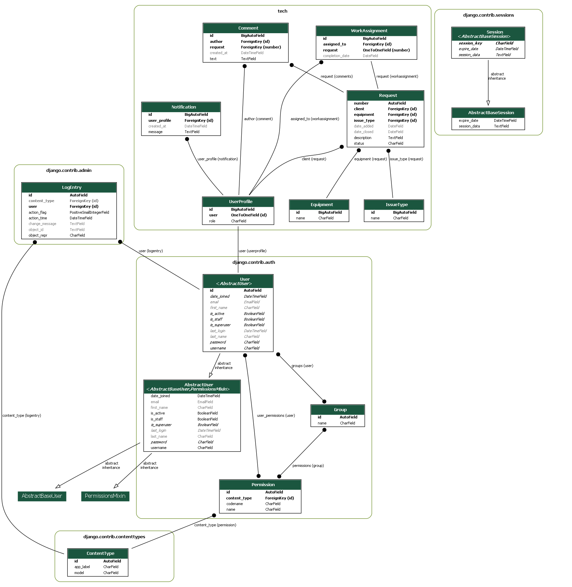

<!DOCTYPE html>
<html lang="en">
<head>
    <meta charset="UTF-8">
    <meta name="viewport" content="width=device-width, initial-scale=1.0">
    <title>Project Readme</title>
    
</head>

<body>
    <h1>Project Readme</h1>
    

        
    

    

        This Django application is designed for managing service requests related to equipment. Users can register,
        log in, create, edit, and delete service requests. Different roles (user, ispolnitel, admin) have different
        levels of access and functionality.
    

    

        The main features include creating and managing service requests, assigning tasks to ispolnitels, tracking
        notifications, and viewing statistics on completed requests. The application uses Django's ORM for database
        interactions and provides a simple and intuitive interface for users with different roles.
    

    

        For more detailed information, refer to the code and comments in the Django project files.
    

</body>

</html>
